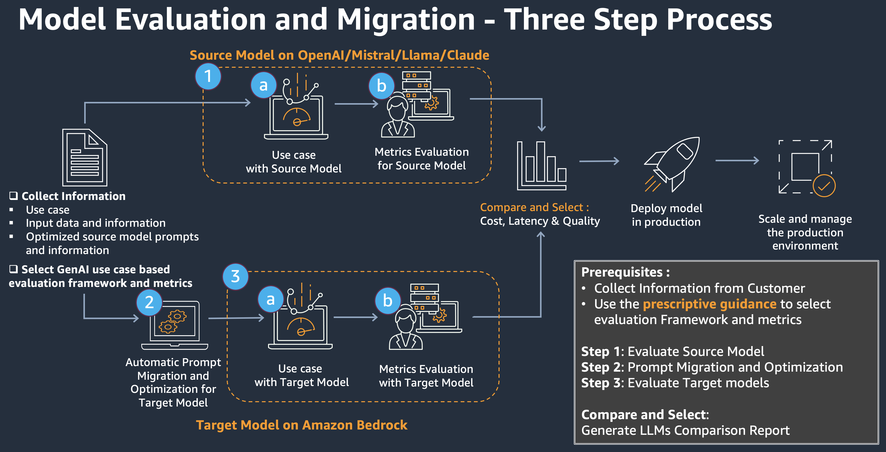
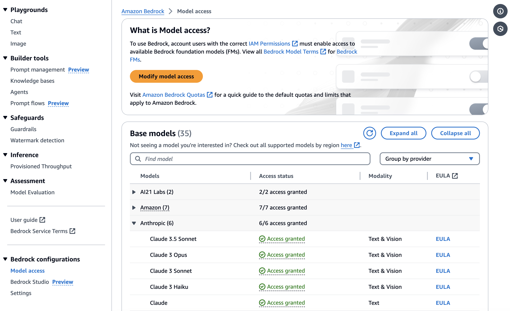
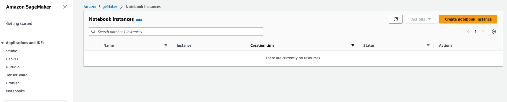
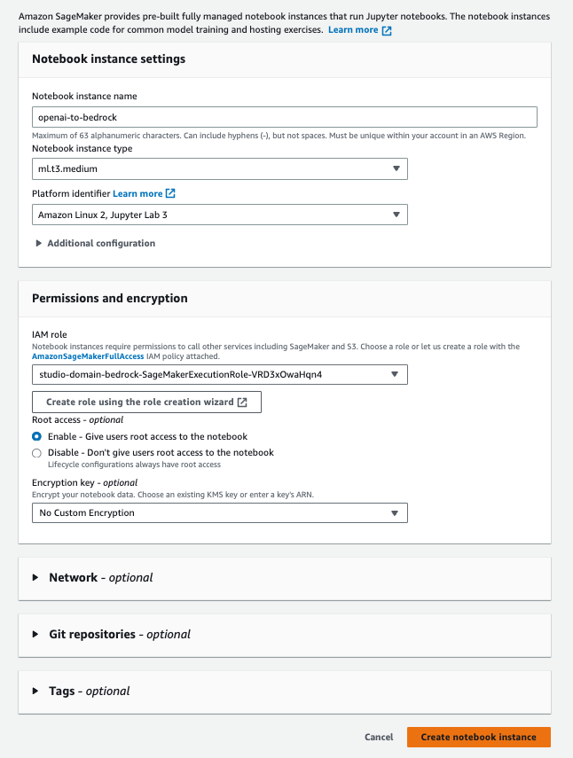
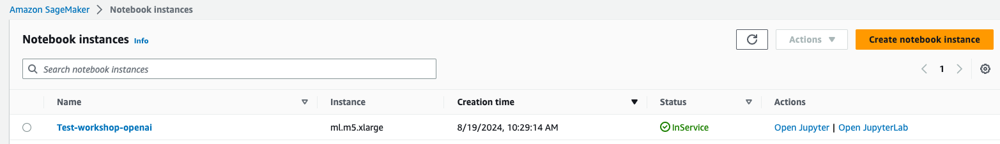
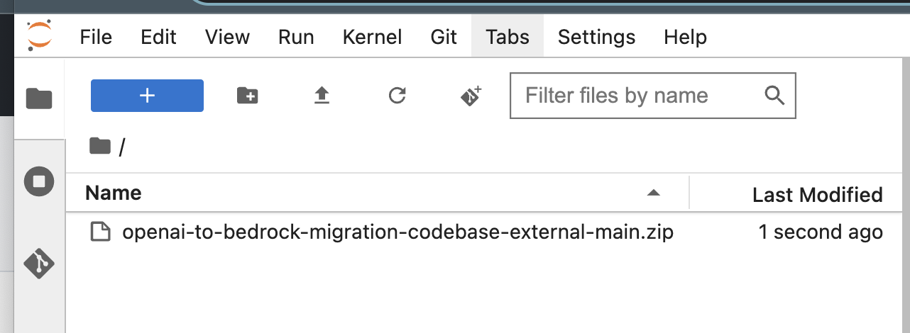
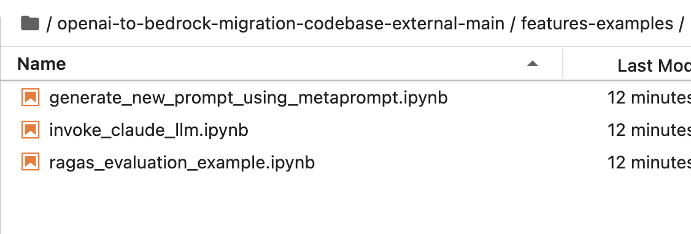
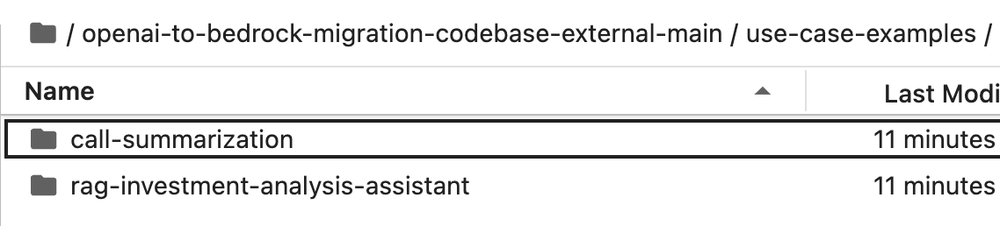

# Prompt Migration for Large Language Model Agility

Through this codebase, we introduce a systematic framework for LLM migration/upgrade in GenAI production, encompassing essential tools, methodologies, and best practices. The framework facilitates transitions between different LLMs by providing robust protocols for prompt conversion and optimization. It includes evaluation mechanisms that assess multiple performance dimensions, enabling data-driven decision-making through detailed and comparative analysis of source and destination models. The proposed approach offers a comprehensive solution encompassing the technical aspects of model migration while simultaneously providing quantifiable metrics to validate successful migration and identify areas for further optimization, ensuring a seamless transition and continuous improvement.
More importantly, this repository is designed to provide a playbook for users to experiment and help users to make decisions on model migrations by evaluating source and destination Large Language Models(LLMs) with various  performance metrics and generate a comparison report with cost and latency for two use cases. 1. Call summarization 2. An Intelligent RAG based Financial Analyst. 
 


There are three main steps in the model evaluation and migration process.
  1. Evaluation for Source Model
  2. Prompt Migration and Optimization for Target Model
  3. Evaluation for Target Model

In the end of the notebook, we will generate a full comparison report of the source and target model comparison with performance metrics, latency and cost. By walking through each notebooks in the repo, users will gain in-depth understanding of how to evaluate and make a decision to migrate an application from source model to Amazon Bedrock.

## Getting started

### Bedrock Model Setup
Go to the AWS Console -> Amazon Bedrock -> Model Access 

Model acces is available on the left panel, at the bottom of the menu. Select the models you wish to get access to and request access. (Please note the AWS region that you are in when requesting model access.)



### IAM Policy for conducting source model to Amazon Bedrock Migration in AWS cloud
This codebase requires an IAM role that has access to Amazon Bedrock. Here is an example IAM policy to grant access to Bedrock APIs and the other policies you will need for this workshop (DynamoDB, Lambda, Opensearch Serverless, Bedrock, IAM, Delete S3 Bucket):

IAM Policy for Advanced Agents for Bedrock Workshop This codebase requires an IAM role that has access to Amazon Bedrock. Here is an example IAM policy to grant access to Bedrock APIs and the other policies you will need for this workshop (DynamoDB, Lambda, Opensearch Serverless, Bedrock, IAM, Delete S3 Bucket):
```{
   {
	"Version": "2012-10-17",
	"Statement": [
		{
			"Sid": "OtherServices",
			"Effect": "Allow",
			"Action": [
                "dynamodb:*",
                "bedrock:*",
                "aoss:*",
                "lambda:*",
                "iam:*"
			],
			"Resource": "*"
		},
		{
			"Sid": "S3Delete",
			"Effect": "Allow",
			"Action": "s3:DeleteObject",
			"Resource": "arn:aws:s3:::*/*"
		},
		{
			"Sid": "S3DeleteBucket",
			"Effect": "Allow",
			"Action": "s3:DeleteBucket",
			"Resource": "arn:aws:s3:::*"
		}
	]
}
}
```

  ##### IMPORTANT NOTE:
  ##### If you are running the notebooks in SageMaker Studio, add this policy to the SageMaker role. If you are running the notebooks in your own environment, ensure your user/role has these permissions.

### AWS SageMaker
In the AWS console, navigate to Amazon SageMaker service and choose "Notebooks" on the left hand side panel.

- Create notebook instance Click on "Create notebook Instance".


- Add the necessary details such as Name, instance type and execution role as shown in the diagram. Please create a new execution role with all necessary permissions if you don't have already.



- Once the notebook gets created, you will see the Status as "InService" as shown below. Click on "Open JupyterLab" and it will launch the JupyterLab on browser.


- Downloading code samples from the GitHub repo

- Download the code repo in zip file and upload the file to Jupyeter Lab on Sagemaker.


- Open the terminal and unzip the file.
```unzip prompt-migration-for-large-language-model-agility.zip```

Now you will see all the files in this repo ready to use for the migration process.

### Repo Structure Instructions

There will be two folders the users can get started with:
1. Feature Examples
2. Use Case Examples

#### Feature Examples
For individual features such as functions to invoke Claude model and generating Claude prompts using metaprompts, please refer to the "feature-examples" folder.


#### Use Case Examples
Click on the use-case-examples and choose the use case you would like to start experimenting an end-to-end migration process for different use cases:

1.  Call Summarization Use Case
2.  Investment Analysis Assistant RAG Use Case

* Run through notebooks under the "notebooks" folder for a end-to-end migration pipeline.
* The input data is stored under "data/sample_docs", if you wish to bring in your own data please replace the documents there.
* The prompts are stored under ""data/prompts" for different Large Language Models(LLMs) 
* Please replace the prompts for your source model under the repected folder. The migrated prompts for target model will also be stored here after running the prompt_migration notebook.
* The Evaluation Reports are stored under "outputs/evaluation_reports/" for different frameworks(ie. Deepeval or RAGAS)


## Resources and References

* [In-house RAGAS evaluation package with BedRock](https://github.com/aws-samples/prompt-migration-for-large-language-model-agility/tree/main/use-case-examples/rag-investment-analysis-assistant/libraries/ragas-evaluation) 
* [Official RAGAS pacakge](https://github.com/explodinggradients/ragas)
* [Anthropic metaprompt method](https://docs.anthropic.com/en/docs/helper-metaprompt-experimental) 
* [Anthropic documentation for Claude models](https://docs.anthropic.com/en/docs/intro-to-claude)


## Support
longchn@amazon.com, aviyadc@amazon.com, uelaine@amazon.com, aminikha@amazon.com, fccal@amazon.com, gunsuren@amazon.com, ravividy@amazon.com


## Contributing
Contributions are welcome!


